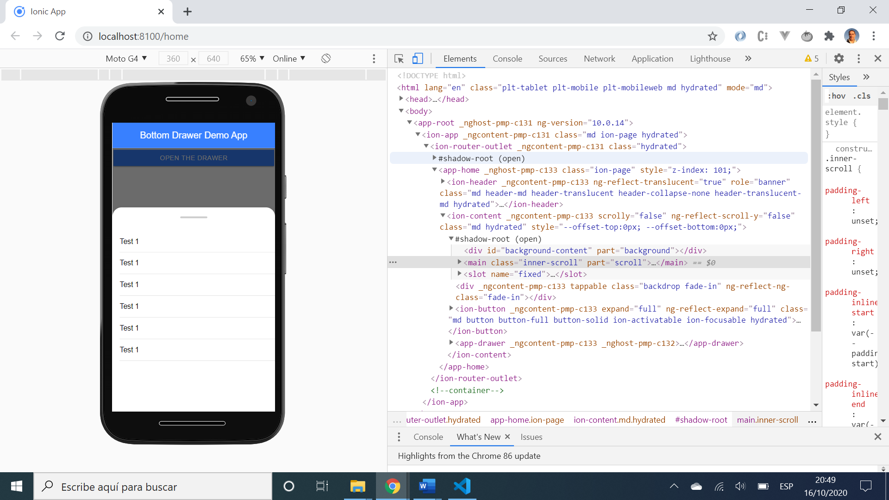

# :zap: Ionic Angular Audio Reproduction

* App to open a bottom drawer using gestures.
* Another great tutorial from [Simon Grimm 'How to Create an Ionic Bottom Drawer with Gestures'](https://www.youtube.com/watch?v=xl4S8FM8Wcc&t=0s).

## :page_facing_up: Table of contents

* [:zap: Ionic Angular Audio Reproduction](#zap-ionic-angular-audio-reproduction)
  * [:page\_facing\_up: Table of contents](#page_facing_up-table-of-contents)
  * [:books: General info](#books-general-info)
  * [:camera: Screenshots](#camera-screenshots)
  * [:signal\_strength: Technologies](#signal_strength-technologies)
  * [:floppy\_disk: Setup](#floppy_disk-setup)
  * [:computer: Code Examples](#computer-code-examples)
  * [:cool: Features](#cool-features)
  * [:clipboard: Status \& To-do list](#clipboard-status--to-do-list)
  * [:clap: Inspiration](#clap-inspiration)
  * [:file\_folder: License](#file_folder-license)
  * [:envelope: Contact](#envelope-contact)

## :books: General info

* Ion-button and gestures used to open or close a drawer with text

## :camera: Screenshots



## :signal_strength: Technologies

* [Ionic/angular v7](https://ionicframework.com/)
* [Angular v16](https://angular.io/)

## :floppy_disk: Setup

* `npm i`
* `ionic serve` to start the server on _localhost://8100_

## :computer: Code Examples

* extract from `drawer.component.ts` to gently open or close the drawer when HTML button is toggled

```typescript
// Function activated by html button to open drawer if closed and vice-versa
 // ViewChild 'drawer' used with the read: ElementRef metadata property above
 toggleDrawer() {
  const drawer = this.drawer.nativeElement;
  this.openState.emit(!this.isOpen);

  if (this.isOpen) {
   drawer.style.transition = '.4s ease-out';
   drawer.style.transform = '';
   this.isOpen = false;
  } else {
   drawer.style.transition = '.4s ease-in';
   drawer.style.transform = `translateY(${-this.openHeight}px)`;
   this.isOpen = true;
  }
 }
```

## :cool: Features

* SCSS makes drawer open and close gently

## :clipboard: Status & To-do list

* Status: Working.
* To-do: Button text can be linked to drawer status so it says 'open drawer' when drawer closed and 'close drawer' when drawer open. Other scss effects could be added to make the drawer opening/closing more fun.

## :clap: Inspiration

* [Simon Grimm 'How to Create an Ionic Bottom Drawer with Gestures'](https://www.youtube.com/watch?v=xl4S8FM8Wcc&t=0s).

## :file_folder: License

* This project is licensed under the terms of the MIT license.

## :envelope: Contact

* Repo created by [ABateman](https://github.com/AndrewJBateman), email: `gomezbateman@gmail.com`
